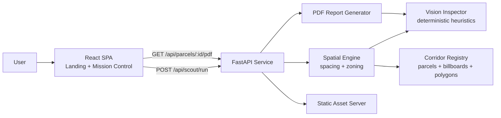
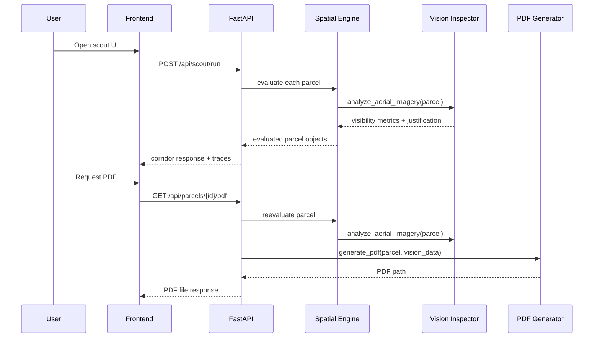
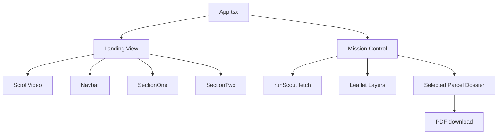
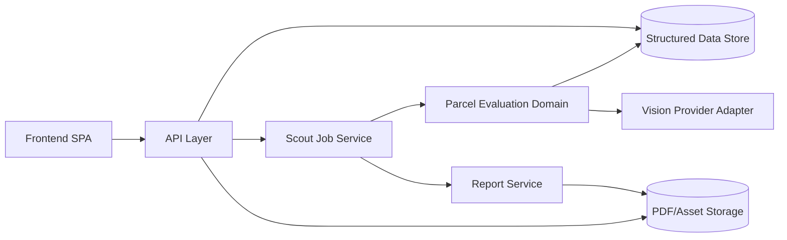

# GeoSignAI Repository Deep Dive

_Last reviewed: August 24, 2026_

## Purpose Of This Document

This document explores the repository from three complementary angles:

1. Software architect: system shape, boundaries, runtime responsibilities, deployment model, and technical risks.
2. Software developer: code organization, implementation patterns, data contracts, maintainability, and test reality.
3. Product manager: user promise, demo narrative, market fit implied by the code, readiness level, and roadmap opportunities.

This review combines direct source inspection with the existing `graphify-out/` knowledge graph that is already checked into the repository. Graphify was useful for broad structural orientation, but its output is partially polluted by minified frontend bundles in `backend/static/assets/`, so this document relies on source files as the authoritative view.

---

## Executive Summary

GeoSignAI is a demo-forward full-stack application for automated billboard siting analysis along Texas highway corridors. It combines:

- A Python/FastAPI backend that evaluates parcels against billboard spacing and zoning constraints.
- A deterministic "vision agent" that simulates multimodal sightline reasoning.
- A PDF generator that produces a one-page feasibility artifact.
- A React/Vite frontend that presents the system as a premium "mission control" product experience.

At a high level, the repo succeeds as a compelling prototype and storytelling vehicle. It communicates a sharp product concept quickly, and the main path from UI -> API -> parcel evaluation -> PDF generation is easy to follow.

At the same time, the codebase shows a meaningful gap between:

- the product story ("autonomous multimodal AI fleet"),
- the implementation reality (rule-based geospatial scoring plus static/deterministic vision heuristics),
- and the test story (some current tests, some clearly stale tests from an earlier architecture).

If I had to summarize the repo in one sentence:

> This is a polished vertical demo with a coherent golden path, backed by real-looking corridor data, but it is not yet a production-grade geospatial intelligence platform.

---

## Repository At A Glance

### Top-Level Layout

```text
.
|- README.md
|- Dockerfile
|- requirements.txt
|- cloudbuild.yaml
|- backend/
|  |- main.py
|  |- spatial_engine.py
|  |- vision_agent.py
|  |- report_generator.py
|  |- data/corridor_data.py
|  |- static/
|  |- generated_reports/
|  `- test_*.py
|- frontend/
|  |- src/
|  |- public/
|  |- package.json
|  `- vite.config.ts
`- graphify-out/
```

### What Each Area Is For

- `backend/`: the actual application engine and API surface.
- `frontend/`: the source for the marketing landing page and the interactive scout UI.
- `backend/static/`: built frontend assets copied or bundled into the Python service for single-container serving.
- `backend/generated_reports/`: sample or generated PDF outputs checked into the repo.
- `graphify-out/`: persisted repository knowledge graph and report artifacts.
- root Docker and requirements files: convenience deploy path for containerizing the backend.

---

## Product Lens

## What Product Is Being Built?

The repository is building a vertical workflow product for the out-of-home advertising market, specifically billboard siting and permitting.

The product promise is:

- shorten manual corridor scouting from months to minutes,
- validate legal spacing and zoning,
- estimate visibility and ad revenue,
- produce permit-ready or at least sales-ready artifacts,
- and present all of this through an operator-facing command center.

### Primary User Archetypes Implied By The Repo

1. Billboard operator / acquisitions lead
   Needs fast parcel triage and candidate discovery.

2. Permitting / compliance analyst
   Needs legal spacing and zoning evidence.

3. Land acquisition or brokerage user
   Needs a shareable artifact to convince owners or internal stakeholders.

4. Demo audience / judges / investors
   Needs to feel the "agentic" story immediately.

### Strong Product Signals

- The landing page is highly focused and communicates value quickly.
- The "Mission Control" framing creates a memorable product identity.
- The output PDF closes the loop from analysis to artifact.
- The UI centers the highest-value unit of work: selecting a parcel and understanding whether it is viable.

### Product Reality Check

The product language overstates current implementation maturity in a few places:

- "Gemini 3.5/2.5 multimodal vision" is presented as core intelligence, but `backend/vision_agent.py` is deterministic and does not call a model.
- "live TxDOT licensed billboard locations" and "real individual parcel lots" may be directionally true, but the runtime is entirely local and file-backed.
- "autonomous fleet" is mostly a single synchronous request pipeline without orchestration, job queues, agents, or async execution traces.

This does not make the product concept weak. It means the repo is strongest today as a sophisticated demo or proof-of-concept, not yet as an operational SaaS platform.

---

## Architect Lens

## System Architecture



### Architectural Style

The app is a monolith with embedded frontend delivery.

That monolith contains four sub-concerns:

1. API surface and routing in `backend/main.py`
2. Domain evaluation logic in `backend/spatial_engine.py`
3. "AI" scoring logic in `backend/vision_agent.py`
4. artifact generation in `backend/report_generator.py`

This is a reasonable shape for a hackathon or early-stage demo because:

- there are few network boundaries,
- the golden path is easy to reason about,
- deployability is simple,
- and the backend can serve the frontend directly.

### Runtime Request Flow



## Major Architectural Strengths

### 1. Clear domain pipeline

The backend is easy to mentally model:

- corridor data in,
- parcel evaluation,
- sightline scoring,
- response or PDF out.

That is a strong starting point for future refactoring.

### 2. Simple deployment story

The application is designed to run as a single container on Cloud Run. That keeps operations friction low.

### 3. Strong demo cohesion

The frontend and backend are aligned around the same narrative: "autonomous scout," map-first inspection, proof of compliance, downloadable report.

### 4. Good separation of concerns inside the monolith

Even though the app is small, the modules do correspond to business capabilities rather than random utility groupings.

## Major Architectural Weaknesses

### 1. Static data is the system's real database

`backend/data/corridor_data.py` is effectively the application's data store. That creates problems:

- no ingestion pipeline,
- no provenance model,
- no update mechanism,
- no schema versioning,
- and poor ergonomics for future extension.

### 2. The vision layer is not really pluggable AI infrastructure

The `GeminiVisionInspector` class exposes an AI-shaped interface, but it behaves like deterministic business logic. This creates architectural confusion because:

- the API key is optional and unused,
- the model name is set but not consumed,
- outputs are derived from local parcel flags,
- and calling code assumes "multimodal reasoning" happened.

### 3. Synchronous corridor evaluation does not scale elegantly

The corridor run evaluates every parcel in a single request-response cycle. For current demo scale this is fine, but production concerns appear quickly:

- request latency,
- resource contention,
- no progress checkpointing,
- no resumability,
- no caching,
- and no async job handling.

### 4. Frontend is effectively coupled to backend data shape quirks

The UI assumes exact response fields and even contains mismatches with backend naming. That contract is informal rather than governed by shared schemas or generated clients.

### 5. Repo contains source and built assets together

`frontend/` is the editable source of truth, while `backend/static/` contains build outputs and media. This creates duplication and drift risk.

---

## Software Developer Lens

## Backend Analysis

### API Surface

The backend exposes a compact API:

- `GET /`
- `GET /api/health`
- `GET /api/corridors`
- `POST /api/scout/run`
- `GET /api/parcels/{parcel_id}/pdf`
- catch-all SPA/static asset serving

This is a sensible minimal API for the current product.

### `backend/main.py`

`main.py` is the integration hub. It wires:

- FastAPI setup,
- permissive CORS,
- data lookup from `CORRIDORS_REGISTRY`,
- parcel evaluation,
- PDF generation,
- and static/SPA serving including byte-range streaming for video.

This file is doing a lot, but not chaotically. It functions as a service composition root.

#### What is good here

- straightforward route definitions,
- typed request/response models,
- predictable data flow,
- and range request handling for media is a nice polish point.

#### What is risky here

- `allow_origins=["*"]` is demo-friendly but overly broad for production.
- global singleton instances (`report_gen`, `vision_inspector`) are fine now but would need review if real external state or credentials are added.
- `ScoutRequest.min_traffic` is accepted but not clearly enforced in the current evaluation path.
- `get_parcel_pdf` reevaluates the parcel from raw data instead of consuming a previously persisted result.

### `backend/spatial_engine.py`

This is the most important domain module in the repo.

It provides:

- `haversine_distance_feet`
- `check_polygon_intersection`
- `evaluate_parcel`

#### Strengths

- readable logic,
- explicit legal/business framing,
- proof object returned with traceable facts,
- and a useful separation between spacing, zoning, and vision.

#### Observations

- The spacing computation is parcel-to-nearest-sign based, which is appropriate for a first-pass legal screen.
- The zoning logic is intentionally simple, based on code matching plus polygon restrictions.
- The proof payload is valuable because it translates computation into user-facing evidence.

#### Limitations

- There is no true "buffer engine" object anymore despite older tests expecting one.
- The geometry model is point-centric, not parcel-boundary-centric, for the legal spacing calculation.
- AADT and economic logic are heuristically translated into revenue with fixed coefficients.
- The county inference is derived from parcel id prefixes, which is brittle.

### `backend/vision_agent.py`

This file is the clearest gap between branding and implementation.

#### What it actually does

It reads parcel fields like:

- `has_dense_trees`
- `aadt_traffic`
- `station_id`
- `coordinates`

Then it computes fixed outputs for two branches:

- obstructed parcel
- clear parcel

Those branches set canned values for:

- sightline distance,
- dwell time,
- canopy density,
- tree height,
- visibility score,
- recommendation,
- and a long-form justification string.

#### Why this matters

From a developer perspective, this is not a multimodal AI agent. It is a deterministic scoring facade that mimics AI output.

That is not inherently bad for a prototype. In fact, it can be a smart way to stabilize demos. But the codebase would benefit from making this explicit.

#### Suggested architectural reframing

Treat this module as one of:

- `SightlineScoringEngine`
- `VisionHeuristicsAdapter`
- or `MockVisionProvider`

Then later introduce a real provider abstraction if model-backed analysis is added.

### `backend/report_generator.py`

The PDF generator is one of the repo's most product-useful components. It turns analysis into a tangible artifact.

#### Strengths

- clean separation from API layer,
- understandable structure,
- visually organized document sections,
- useful blend of legal, commercial, and AI-style fields.

#### Important implementation detail

This module reveals schema drift:

- it looks for `vision_data["sightline_duration_seconds"]`, but the vision layer returns `driver_dwell_time_sec`.
- it looks for `vision_data["recommended_monopole_height_ft"]`, but the vision layer does not provide that field.

Because the code uses `.get(..., default)`, the PDF still renders, but it silently falls back to defaults. That means the artifact may appear richer than the actual upstream data.

## Frontend Analysis

### Frontend Role

The frontend is doing two jobs:

1. High-impact marketing story on the landing page
2. Functional operations-style interface in Mission Control

That is a solid pairing for a demo because it supports both pitch and proof.

### App Shell

`frontend/src/App.tsx` uses a simple pathname/hash-driven two-view model:

- `landing`
- `scout`

There is no formal router. That is acceptable for a small app and keeps bundle complexity down.

### Landing Experience

The landing page is composed from:

- `Navbar.tsx`
- `ScrollVideo.tsx`
- `SectionOne.tsx`
- `SectionTwo.tsx`
- `Reveal.tsx`

#### Strengths

- visually cohesive,
- strong premium-tech aesthetic,
- clear category messaging,
- and good motion restraint for a demo.

#### Developer observations

- The app uses Tailwind v4 via `@import "tailwindcss";` in `frontend/src/index.css`.
- Motion is homegrown and simple.
- There is a strong reliance on copy and art direction rather than interaction depth.

### Mission Control

`frontend/src/components/MissionControl.tsx` is the operational heart of the UI.

It handles:

- map setup with Leaflet,
- fetching corridor analysis,
- rendering parcels, billboards, and buffers,
- selecting parcels,
- and downloading PDFs.

#### Strengths

- strong visual hierarchy,
- clear map overlay semantics,
- useful parcel dossier,
- trace terminal gives the impression of system activity,
- and the selected parcel workflow is intuitive.

#### Developer concerns

- The component is large and mixes data fetching, view state, map orchestration, and rendering.
- Types do not perfectly match backend payloads.
- The component assumes billboard fields like `permit_number`, while backend data uses `permit_id`.
- As a result, billboard popup content can be blank or incorrect.

### Frontend Flow Diagram



## Data Model Analysis

The core dataset is all in `backend/data/corridor_data.py`.

### Current Corridor Footprint

For `I35-50Mile-Regional`, the repository currently contains:

- 172 parcels
- 459 billboards
- 19 cadastral polygons
- 344 centerline points

### Why This Matters

This file is doing triple duty as:

- seed data,
- fixture data,
- and quasi-production business data.

That is efficient for a demo, but it mixes concerns.

### Recommended Evolution

Split this into:

1. source datasets
2. normalized domain models
3. fixtures for tests and demos
4. ingestion/build steps

---

## Graphify Findings And How To Interpret Them

The checked-in graph is genuinely useful, but it also illustrates an important repo hygiene issue.

### What Graphify Saw

The graph report found:

- 53 files
- ~64,971 words
- 1260 nodes
- 3577 edges
- 64 communities

### Useful Graph Insights

- The repo naturally separates into backend, frontend, deploy/config, assets, and generated artifact clusters.
- The PDF outputs connect meaningfully to the product narrative.
- There are no import cycles in the extracted code graph.

### Misleading Graph Artifacts

The graph's top "god nodes" are minified symbols like `$()` and `i()`. That is not a property of your real architecture. It is a consequence of including compiled assets in analysis.

### Recommendation

When using Graphify or similar tooling on this repository in the future, exclude:

- `backend/static/assets/`
- `graphify-out/`
- possibly `backend/generated_reports/`

That will produce a much more truthful graph centered on authored code.

---

## Code Quality And Maintainability

## What Is Clean

- The domain story is easy to follow.
- Module boundaries are understandable.
- The golden path is short.
- Naming is usually explicit and business-oriented.
- The UI is expressive without becoming hard to navigate.

## What Is Fragile

### 1. Contract drift

There are multiple examples of schema drift between components:

- frontend expects `permit_number`, backend supplies `permit_id`
- report generator expects fields the vision layer no longer produces
- old tests expect classes and constants that do not exist anymore

This is the single biggest maintainability issue in the repo.

### 2. Marketing language is embedded in domain code

Many strings and comments read like pitch copy rather than engineering documentation. This is fine for demos, but in production code it can:

- obscure true behavior,
- make debugging harder,
- and encourage overclaiming in outputs.

### 3. Duplication between `frontend/public` and `backend/static`

The same media assets exist in multiple places. That is a common source of stale builds and confusing edit paths.

### 4. Limited configuration discipline

The repo uses hard-coded:

- corridor ids,
- speeds,
- revenue assumptions,
- county mappings,
- threshold logic,
- and remote media URLs.

For a demo, this is acceptable. For a product, these should become explicit configuration or model parameters.

---

## Testing Reality

## Current State

The repo contains a mix of:

- current tests that align with the present architecture
- and stale tests from an earlier implementation

### Tests That Appear Closer To Current Reality

- `backend/test_suite.py`

This test suite references:

- `CORRIDORS_REGISTRY`
- current API routes
- current `evaluate_parcel` style logic

Even here, one assertion is stale: it expects `total_evaluated == 160`, while the current corridor data contains 172 parcels.

### Tests That Are Clearly Stale

- `backend/test_spatial.py`
- `backend/test_vision.py`
- `backend/test_pdf.py`
- likely `backend/test_api.py`

These reference symbols or assumptions that no longer match the codebase:

- `SpatialBufferEngine`
- `REAL_PARCELS_DATA`
- `EXISTING_BILLBOARDS`
- corridor id `I35-Austin`

### Execution Verification

I attempted to run tests in this workspace, but Python test execution is currently blocked by missing local tooling:

- `pytest` is not on PATH
- `python -m pytest` fails because `pytest` is not installed in the active Python environment

That means I could not fully validate runtime behavior here. However, static inspection alone is enough to conclude that several checked-in tests would fail even after installing pytest because they target a previous architecture.

### What This Means

The test suite currently functions more like an archeological record than a trustworthy CI safety net.

---

## Deployment And Operations

## Deployment Shape

There are two containerization paths:

1. root `Dockerfile`
2. `backend/Dockerfile`

Both target a Python/FastAPI deployment model, but they are not identical.

### Root Dockerfile

- installs from root `requirements.txt`
- copies `backend/` into `/app/backend`
- runs uvicorn from `/app/backend`

### Backend Dockerfile

- expects to be built from within `backend/`
- installs from `backend/requirements.txt`
- copies that directory as the app root

### Operational Observation

Having two Dockerfiles is not inherently bad, but here it increases ambiguity:

- which one is authoritative?
- which dependencies are canonical?
- which build context should CI use?

### Cloud Build

`cloudbuild.yaml` builds from the repo root and deploys `gcr.io/$PROJECT_ID/geosign-ai:latest` to Cloud Run.

That suggests the root Dockerfile is the primary deploy path.

## Production Readiness Scorecard

### Strong

- Single-service deployment simplicity
- Clear API surface
- Static asset serving built in
- Container-friendly backend

### Weak

- No environment validation
- No structured logging
- No observability
- No auth
- No persistent store
- No job orchestration
- No contract tests
- No explicit asset build pipeline captured in repo root docs

---

## User Experience Assessment

## What Feels Good

- Strong first impression
- Clean transition from marketing to tool
- Map-first interface fits the domain
- Dossier framing makes parcel review feel concrete
- PDF output gives the workflow a satisfying endpoint

## What Could Improve

- Errors are mostly logged to console rather than surfaced meaningfully to users.
- There is no visible progress bar for long corridor runs.
- The "agent thought traces" are synthetic strings, not actual trace telemetry.
- The app currently supports one corridor path, so the sense of a scalable fleet is implied more than delivered.

---

## Risks And Gaps

## Highest Risk Gaps

### 1. Truthfulness gap between UI language and implementation

If this product is shown to technical buyers, they may quickly notice that the "AI" layer is mostly deterministic heuristics.

### 2. Test drift

The presence of stale tests reduces confidence and increases onboarding friction.

### 3. Data maintenance burden

A giant Python data file does not scale operationally.

### 4. Interface drift across layers

The frontend, vision, and PDF generator are already showing contract mismatch symptoms.

### 5. Build artifact drift

Checked-in built assets can easily diverge from `frontend/src`.

---

## Recommended Refactor Plan

## Phase 1: Make The Current Demo Honest And Stable

1. Rename or reframe the vision layer to reflect heuristic behavior.
2. Align frontend/backend/report field names with a single schema.
3. Remove or repair stale tests.
4. Document the frontend build-to-backend-static workflow.
5. Exclude compiled assets from structural analysis tooling.

## Phase 2: Harden The Product Skeleton

1. Introduce shared typed schemas for API contracts.
2. Move corridor data into structured JSON/GeoJSON or a lightweight database.
3. Add a real service layer between API routes and domain logic.
4. Add proper error states and observable logging.
5. Split generated artifacts from source-controlled examples.

## Phase 3: Build Toward Real Platform Capability

1. Add asynchronous scout jobs with status polling.
2. Add caching and provenance for corridor evaluations.
3. Introduce real vision or imagery provider integration behind an adapter.
4. Persist scout runs and generated PDFs.
5. Support multiple corridors, configurable constraints, and operator workflows.

---

## Suggested Target Architecture



This architecture preserves the current narrative while making room for honest scaling.

---

## Product Roadmap Opportunities

## Short-Term

- corridor comparison mode
- visible legal reasoning panel
- more trustworthy telemetry
- saved scout sessions
- sample artifact gallery

## Mid-Term

- operator dashboards
- parcel watchlists
- corridor ingestion workflows
- permit packet templates by municipality
- richer economics model beyond flat coefficients

## Long-Term

- imagery-backed review workflows
- collaborative underwriting
- landowner outreach packages
- compliance audit history
- multi-state code packs

---

## Final Assessment

GeoSignAI is a strong showcase repo with real product instinct. It demonstrates:

- a compelling narrow problem,
- a visually credible end-user experience,
- a sensible monolithic prototype architecture,
- and a concrete artifact generation loop.

Its biggest challenges are not that the idea is weak. They are that the repository has started to drift in three directions at once:

- demo storytelling,
- implementation truth,
- and test/code contract consistency.

If those are brought back into alignment, this codebase can become a much stronger foundation. Right now, its best description is:

> a polished proof-of-concept that already looks like a product, but still behaves like a prototype under the hood.

---

## Appendix: Key Files Worth Reading First

- `README.md`
- `backend/main.py`
- `backend/spatial_engine.py`
- `backend/vision_agent.py`
- `backend/report_generator.py`
- `backend/data/corridor_data.py`
- `frontend/src/App.tsx`
- `frontend/src/components/MissionControl.tsx`
- `frontend/src/components/ScrollVideo.tsx`
- `cloudbuild.yaml`

## Appendix: Most Important Findings In One Page

- The backend architecture is simple and coherent.
- The frontend is polished and strongly supports the product narrative.
- The spatial evaluation module is the most credible technical core.
- The AI vision layer is currently heuristic, not model-driven.
- The PDF generator is useful but already exhibits schema drift.
- The repo contains both source and compiled frontend artifacts, which confuses analysis and maintainability.
- The test suite is partially stale and cannot currently be trusted as a safety net.
- The data layer is file-backed and tightly coupled to the app.
- The project is strong as a demo and concept vehicle, but not yet production-ready as a platform.
